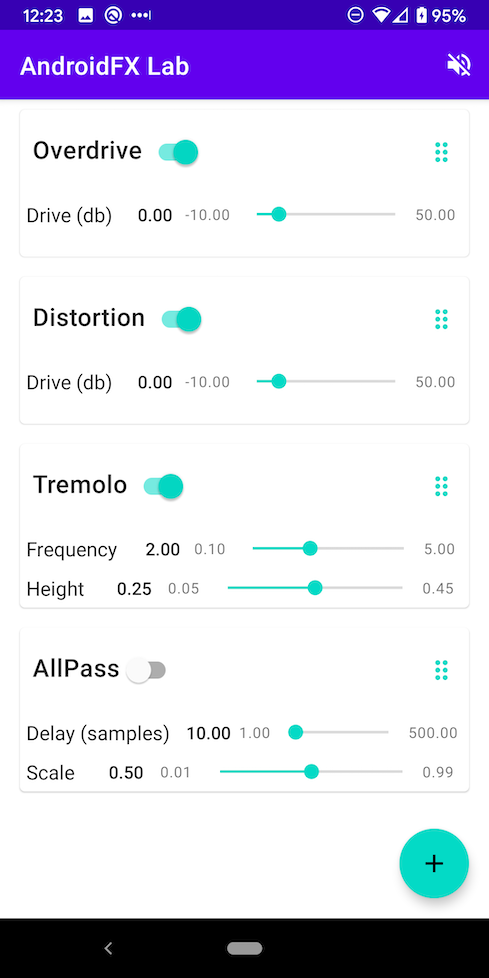

# Android FXLab

## Features
This app performs real-time audio effects with low latency using the [oboe](https://www.github.com/google/oboe) API. 

The audio effects are written natively (in C++), with Kotlin used for the UI.

Supported features include a linear pipeline of real-time effects with re-ordering, enable/disable, and parameter modification.

The effects used should be portable as they operate entirely on numeric type iterators.

## Setup
Connect the android device to the correct audio input and output devices. A simple use-case could be a headset with a microphone while singing or playing an acoustic instrument near the mic. More complicated setups could involve USB audio interfaces, devices such as the iRig 2 interface for guitar effects/amplification or routing audio output to a computer for a recording. 

## Layout

Tap the plus button to add various effects. The current list of effects being applied to the input audio will be shown on the main screen (in order from top to bottom). Use the drag handles on the right of the effect to re-order the effects. Swiping the effect near the title to the right or left will remove the effect. Use the sliders to modify the parameters of each audio effect. Some effect combinations or parameters might lead to unpleasant sounds!

By default the sound output is off when you start the app (this is to avoid a feedback loop if you're not using headphones).  Tap the "Unmute" button in the top right corner to enable sound output.

## Development

A guide to the code, as well as a pdf of a slideshow discussing the code in depth are in the [docs](docs) folder.

## Credits
This app was written by [Atneya Nair](https://www.github.com/atneya)
as a sample app using Oboe to publish on the Play store for an internship on 
the Android Audio team at Google.
# gna-03
